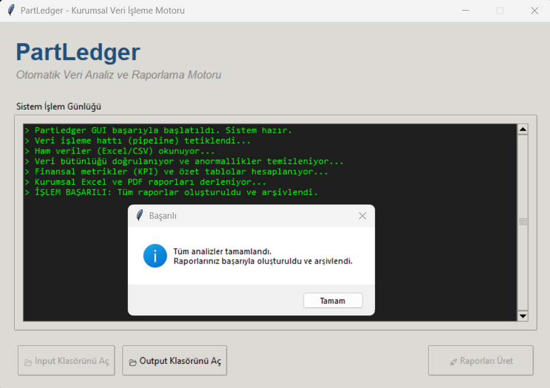
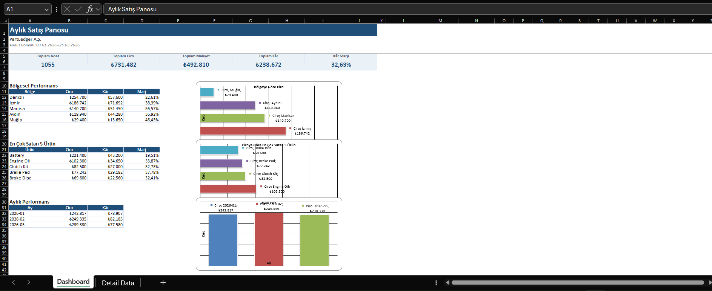
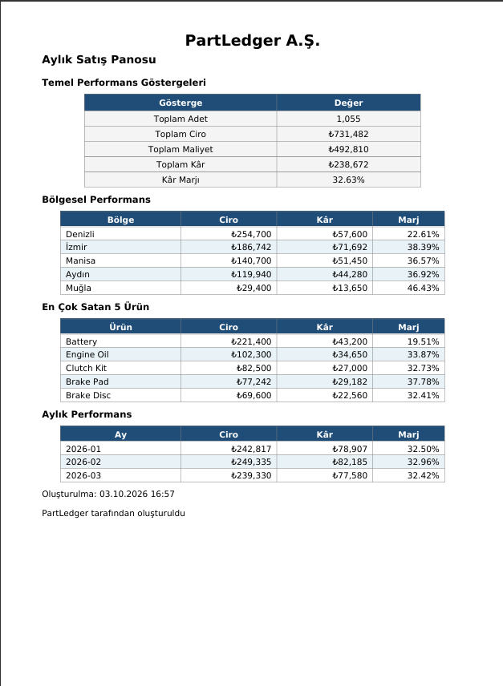

# PartLedger

Excel ve CSV formatındaki satış verilerini otomatik olarak okuyan, doğrulayan,
temizleyen, KPI'ları hesaplayan ve profesyonel bir Excel dashboard ile tek
sayfalık bir PDF yönetici özeti üreten, Windows için paketlenmiş bir masaüstü
raporlama motoru.

> **Not:** Kaynak kod telif hakkı ile korunmaktadır. İzinsiz kopyalanamaz,
> dağıtılamaz veya ticari amaçla kullanılamaz. Bkz. [LICENSE](LICENSE).

---

## Mimari

Proje, katmanlar arası net bir sorumluluk ayrımı (separation of concerns)
üzerine kurulu:

```
Girdi (Excel/CSV)
      │
      ▼
excel_reader     → dosyaları okur, birleştirir
      │
      ▼
validator        → şema, veri tipi, negatif değer, geçersiz tarih kontrolü
      │
      ▼
data_cleaner     → boş satır ve tekrar eden kayıt temizliği
      │
      ▼
kpi_calculator   → ciro/maliyet/kâr/marj hesaplama, bölge/ürün/aylık özet
      │
      ├──▶ report_generator  → Excel dashboard (KPI kartları, tablolar, grafikler)
      └──▶ pdf_report        → tek sayfalık PDF yönetici özeti
      │
      ▼
file_manager     → zaman damgalı arşivleme
```

Arayüz (`main.py`) bu katmanları çağıran ince bir katmandır; iş mantığını
kendi içinde barındırmaz. Ağır işlemler (okuma → hesaplama → rapor üretimi)
arka planda ayrı bir **thread** üzerinde çalışır — arayüz işlem sırasında
donmaz, kullanıcı ilerlemeyi canlı bir log penceresinden takip eder.

## Öne Çıkan Özellikler

- Çoklu Excel/CSV dosyasını otomatik okuma ve birleştirme
- Kapsamlı veri doğrulama: eksik kolon, sayısal olmayan değer, geçersiz
  tarih, negatif değer kontrolü — hatalı veri kullanıcıya anlaşılır bir
  mesajla bildirilir, program çökmez
- KPI hesaplama: toplam ciro, maliyet, kâr, kâr marjı
- Bölgesel, ürün bazlı (Top 5) ve aylık performans analizi
- Excel Dashboard: KPI kartları, 3 grafik, kurumsal logo, tamamen Türkçe arayüz
- Tek sayfalık PDF yönetici özeti (Unicode/Türkçe karakter destekli font ile)
- Multithreading destekli grafik arayüz — işlem arka planda çalışırken arayüz
  yanıt vermeye devam eder
- Otomatik zaman damgalı arşivleme
- JSON ile yapılandırılabilir kurum bilgisi (isim, logo, para birimi)
- PyInstaller ile tek dosya Windows EXE paketleme
- **33 otomatik birim testi** — KPI doğruluğu, validation, edge case'ler,
  Excel/PDF üretimi, dosya yönetimi ve config yükleme dahil, tamamı geçiyor

## Kullanılan Teknolojiler

Python 3, pandas + openpyxl (veri ve Excel işleme), ReportLab (PDF, Unicode
font desteğiyle), Loguru (loglama), pytest (test), Tkinter (arayüz),
PyInstaller (EXE paketleme).

## 📸 Ekran Görüntüleri

| Canlı Konsol ve Arayüz | Otomatik Excel Raporu | Otomatik PDF Çıktısı |
| :---: | :---: | :---: |
|  |  |  |

## Kurulum

```
git clone https://github.com/aliyagiz207-maker/PartLedger.git
cd PartLedger
python -m venv .venv
.venv\Scripts\activate
pip install -r requirements.txt
```

## Kullanım

```
python src/main.py
```

Testleri çalıştırmak için:

```
python -m pytest -v
```

Windows EXE üretmek için:

```
pip install pyinstaller
pyinstaller PartLedger.spec --clean
```

## Yapılandırma

```json
{
    "company_name": "Örnek Şirket A.Ş.",
    "dashboard_title": "Aylık Satış Panosu",
    "currency": "₺",
    "logo_path": "assets/logo_placeholder.png",
    "output_file": "data/output/PartLedger_Rapor.xlsx"
}
```

## Lisans

Bu proje özeldir, tüm hakları saklıdır. Ayrıntılar için [LICENSE](LICENSE).

## Geliştirici

**Ali Yağız Demir** — <https://github.com/aliyagiz207-maker>
